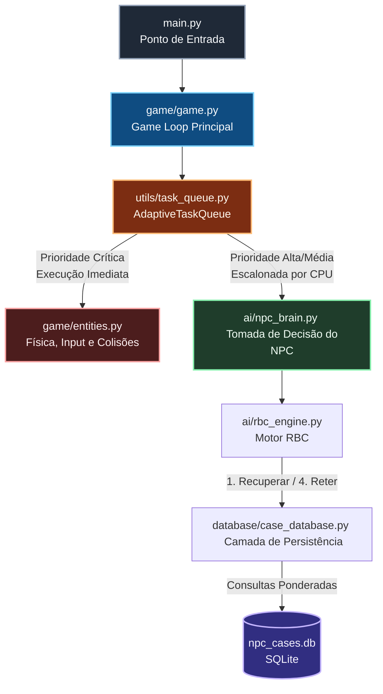

# RTS Tanks - Sistema de IA com Raciocínio Baseado em Casos

<p align="center">
   
</p>

<p align="center">
   
   
</p>

## Visão Geral do Projeto

Este projeto consiste no desenvolvimento de um protótipo de jogo de Estratégia em Tempo Real (RTS) desenvolvido em Python utilizando a biblioteca Pygame. O foco central do trabalho é a implementação de um agente autônomo (NPC) dotado de Inteligência Artificial baseada na metodologia de **Raciocínio Baseado em Casos (RBC)**, integrada a um banco de dados relacional leve para persistência e evolução do conhecimento.

Para assegurar a estabilidade do ciclo principal do jogo (Game Loop) sob cargas computacionais flutuantes, o sistema incorpora uma **Fila de Tarefas Adaptativa baseada em Prioridades**, que distribui e escalona o processamento de rotinas não-críticas conforme a disponibilidade real de CPU do sistema host.

---

## Arquitetura do Sistema

O diagrama abaixo ilustra o fluxo de execução e a segmentação de responsabilidades entre as camadas do software, destacando como a Fila de Tarefas gerencia o processamento da engine e do motor de inferência:



---

## Pilares Arquiteturais

O ecossistema do software é segmentado em quatro camadas independentes e modulares:

1. **Núcleo de Simulação (Game Engine):** Gerencia o ciclo principal, renderização tridimensional simulada em 2D, detecção física de colisões de alta prioridade e controle de estados das entidades (Tanks e Projéteis). Desenvolvido nativamente sobre a biblioteca **Pygame**.
2. **Motor de Inferência (RBC Engine):** Orquestra o ciclo RBC clássico (Recuperar, Reutilizar, Revisar e Reter). Transforma o vetor de percepção do NPC (distância, ângulo, saúde e visibilidade) em uma estrutura de problema para determinar a ação tática ideal.
3. **Persistência de Conhecimento (Database Layer):** Interface assíncrona baseada em **SQLite** que armazena os casos de semente (conhecimento prévio) e registra de forma incremental as novas experiências validadas pelo índice de eficácia em tempo de execução.
4. **Gerenciamento de Carga (Utility Layer):** Monitora o consumo de processamento por meio da biblioteca **psutil** e adia dinamicamente tarefas de menor prioridade (como amostragem de logs ou IA de suporte) para quadros subsequentes se o limite de CPU configurado for excedido.

---

## 🎮 Executável Direct (Jogar sem instalar Python)

O jogo possui um arquivo executável standalone compilado para **Windows**, dispensando a instalação prévia do Python ou de dependências do ambiente (`pygame`, `psutil`).

### 🚀 Como Executar o Binário:
1. Acesse o diretório `dist/`.
2. Dê um duplo clique no arquivo **`RTS_Simple_Game.exe`** (ou execute via terminal `./dist/RTS_Simple_Game.exe`).
3. O banco de dados de conhecimento da IA (`npc_cases.db`) acompanha o binário no mesmo diretório e armazena incrementalmente o aprendizado das partidas.

### 🛠️ Como Gerar um Novo Executável (.exe):
Caso realize alterações no código-fonte e deseje compilar um novo binário standalone:
1. Execute o script de compilação automatizado:
   ```bash
   python build_exe.py
   ```
2. O script executará o PyInstaller e copiará o banco de dados `npc_cases.db` automaticamente para a pasta `dist/`.

---

## Estrutura de Diretórios do Repositório

```text
.
├── main.py                # Ponto de entrada unificado da aplicação em Python
├── build_exe.py           # Script de automação para compilação do executável (.exe)
├── dist/                  # Diretório contendo o executável compilado e banco de dados
│   ├── RTS_Simple_Game.exe# Executável do jogo para Windows
│   └── npc_cases.db       # Banco de dados de casos da IA RBC
├── .gitignore             # Definição de arquivos e binários desconsiderados pelo Git
├── ai/                    # Módulos relativos à lógica de inteligência artificial e modelos RBC
├── database/              # Infraestrutura de persistência de dados e scripts de inicialização
├── docs/                  # Centralização de relatórios técnicos e guias de arquitetura
├── game/                  # Lógica do jogo, gerenciamento de entidades, interface e constantes
├── tests/                 # Suíte de testes unitários para verificação de regressão
└── utils/                 # Utilitários de otimização, monitoramento e gerenciamento de tarefas
```

---

## Índice da Documentação Técnica

Para obter detalhes aprofundados sobre a implementação teórica, guias de desenvolvimento e configurações avançadas, consulte os documentos listados abaixo presentes no diretório `docs/`:

* **[Especificação Arquitetural](docs/ARQUITETURA.md):** Contém o mapeamento completo de dependências, fluxo de decisão do NPC entre as camadas e diagrama estrutural do ciclo RBC acoplado ao SQLite.
* **[Manual de Implementação RBC](docs/README_RBC.md):** Explicação matemática do cálculo de similaridade por pesos ponderados, estrutura de dados dos componentes (Problem, Solution, Outcome) e práticas de Clean Code adotadas.
* **[Arquitetura da Fila de Tarefas](docs/TASK_QUEUE_README.md):** Teoria de funcionamento do algoritmo adaptativo de distribuição de carga computacional e mitigação de picos de processamento em tempo de execução.
* **[Guia de Início Rápido](docs/QUICK_START.md):** Instruções simplificadas passo a passo para instalação de dependências e validação inicial das ferramentas.
* **[Manual de Integração Prática](docs/INTEGRATION_GUIDE.md):** Tutorial direcionado para a manutenção e expansão do ciclo principal da aplicação associado ao sistema de prioridades.
* **[Exemplos de Código](docs/examples/task_queue_integration.py):** Scripts isolados demonstrando cenários hipotéticos de escalabilidade e tratamento estatístico do consumo de CPU.

---

## Protocolo de Execução Inicial

Para iniciar a aplicação a partir de um ambiente limpo, siga o procedimento operacional padrão detalhado a seguir:

1. Instale as dependências externas necessárias (Game Engine e Telemetria) no interpretador Python local:
   ```bash
   pip install pygame psutil
   ```

2. Execute o inicializador do banco de dados para criar o esquema relacional e injetar a base de conhecimento inicial necessária para a tomada de decisões do NPC:
   ```bash
   python -m database.initializer
   ```

3. Inicie o ciclo principal da simulação através do ponto de entrada centralizado:
   ```bash
   python main.py
   ```

Para homologação de alterações estruturais na inteligência ou no motor de tarefas, utilize os testes de regressão automatizados:
```bash
python -m unittest discover tests
```